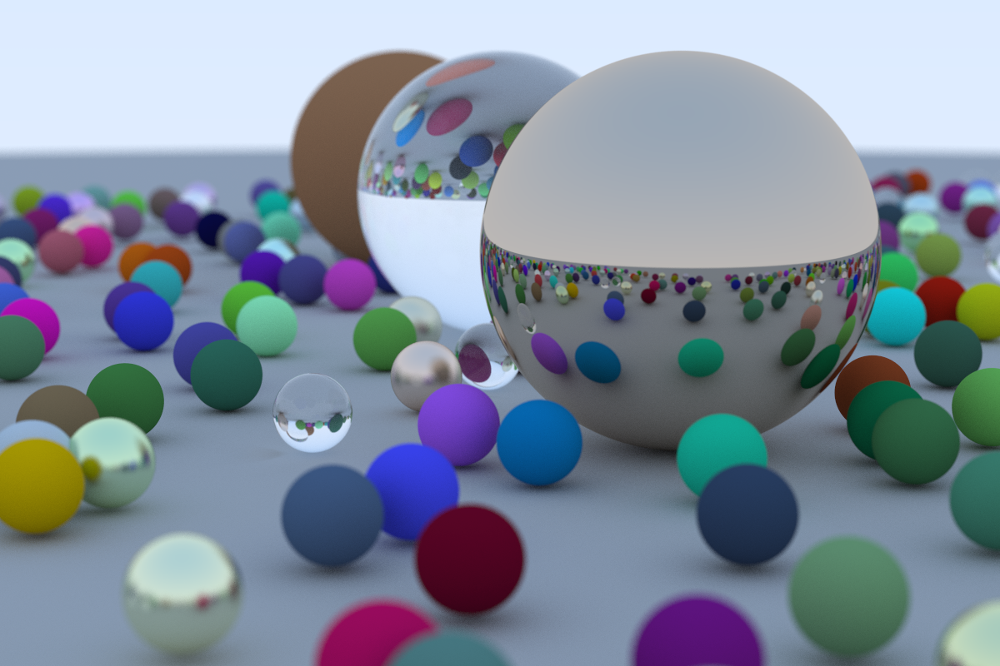

# Basic Raytracer

Simple project to learn about path tracing. Made following version 3 of [Ray Tracing in One Weekend](https://raytracing.github.io/v3/index.html), with some modification to use more modern C++ features. The contents of the first two books have been implemented, with only the extras missing.

Cover of the first book, as produced by the application:

## ToDo

- [ ] Finish extras from the first book
- [ ] Finish extras from the second book
- [ ] Implement the contents from the third book

And then move on to reading through ✨[Physically Based Rendering](https://pbr-book.org/)✨!