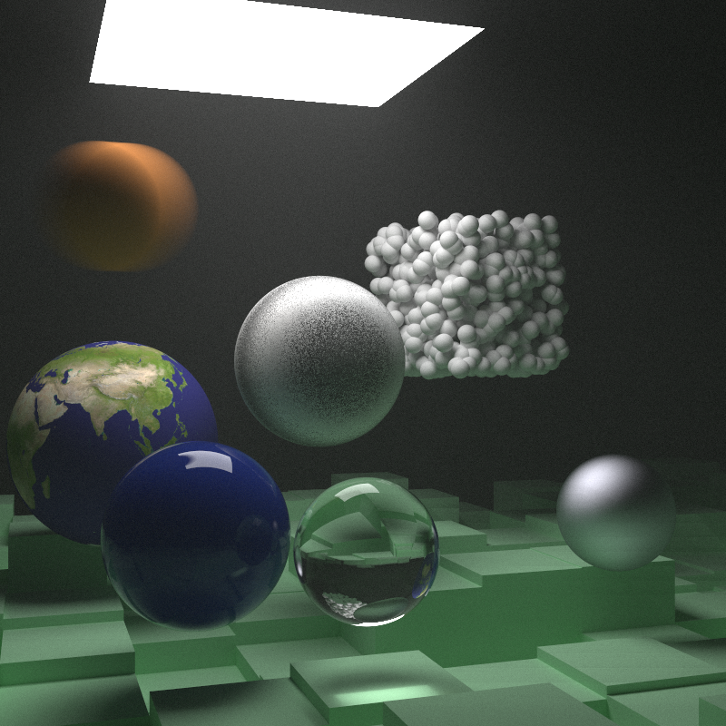

# Ray Tracer

Basic implementation of path tracing with a focus on correctness over performance written using modern C++ 20 features.

## Features

- [x] Thin-lens camera model with configurable focus distance, aperture and motion blur support.
- [x] Various geometric primitives: spheres, boxes and planes.
- [x] Various material models: lambertian, metalic, dielectric, isotropic and diffuse emissors.
- [x] Various texture models: solid colours, checker textures and custom images.
- [x] Support for constant-density mediums.
- [x] Bounding Volume Hierarchy using Axis-Aligned Bounding Boxes for fast ray-scene intersections.
- [x] Perlin noise generation.
- [ ] Light scattering.
- [ ] Monte Carlo integration and Importance Sampling.
- [ ] ✨[Physically Based Rendering](https://pbr-book.org/)✨!

